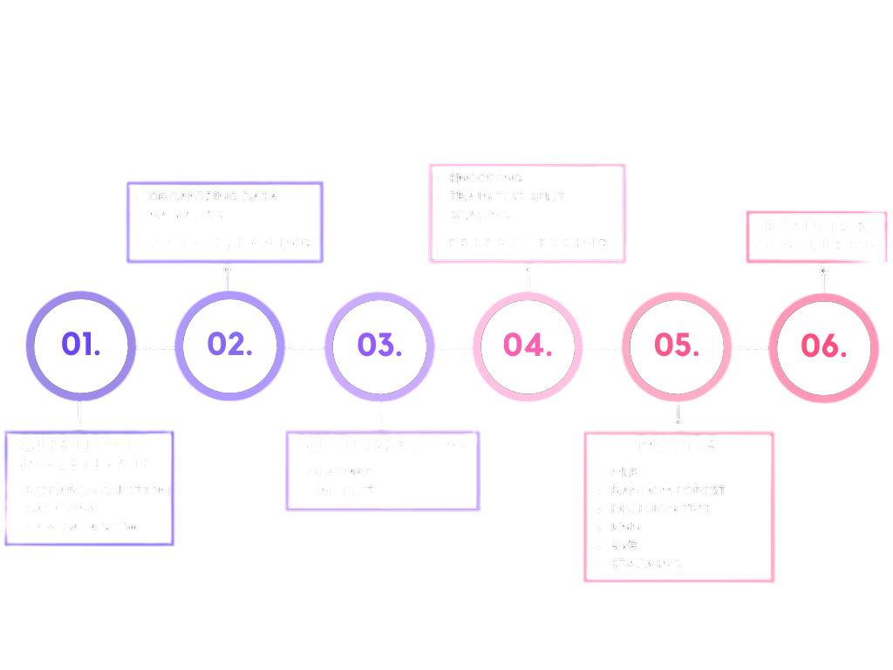

# Predicting-Salaries-Index-With-Different-Machine-Learning-Methods
## Data 📊
Please refer to the link in the notebook to download the data...
## Project Flow 🌊
Heres an image summarizing the flow of the project...👇

## For better code viewing📔
To see the code compiled as an R Notebook please follow the link: [here](https://rpubs.com/purplepurple/Predicting-Salaries-Index-With-Different-Machine-Learning)

## THANK YOU FOR READING 😊

